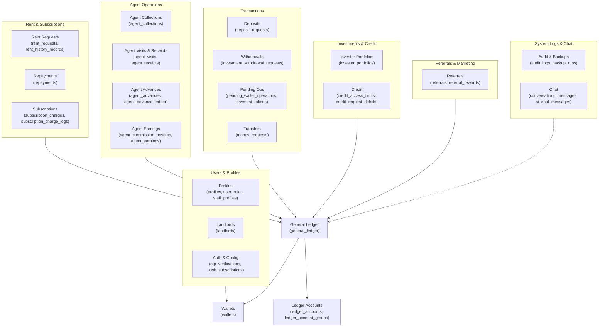

```mermaid
flowchart TD
    %% Core Ledger & Wallets
    GeneralLedger["General Ledger\n(general_ledger)"]
    Wallets["Wallets\n(wallets)"]
    Accounts["Ledger Accounts\n(ledger_accounts, ledger_account_groups)"]
    
    GeneralLedger --> Wallets
    GeneralLedger --> Accounts

    %% Users & Profiles
    subgraph Users ["Users & Profiles"]
        Profiles["Profiles\n(profiles, user_roles, staff_profiles)"]
        Landlords["Landlords\n(landlords)"]
        Auth["Auth & Config\n(otp_verifications, push_subscriptions)"]
    end
    Users -.-> Wallets
    
    %% Rents & Subscriptions
    subgraph Rent ["Rent & Subscriptions"]
        RentRequests["Rent Requests\n(rent_requests, rent_history_records)"]
        Repayments["Repayments\n(repayments)"]
        Subscriptions["Subscriptions\n(subscription_charges, subscription_charge_logs)"]
    end
    Rent --> GeneralLedger

    %% Agent Operations
    subgraph Agents ["Agent Operations"]
        Collections["Agent Collections\n(agent_collections)"]
        Visits["Agent Visits & Receipts\n(agent_visits, agent_receipts)"]
        Advances["Agent Advances\n(agent_advances, agent_advance_ledger)"]
        Earnings["Agent Earnings\n(agent_commission_payouts, agent_earnings)"]
    end
    Agents --> GeneralLedger

    %% Transactions
    subgraph Transactions ["Transactions"]
        Deposits["Deposits\n(deposit_requests)"]
        Withdrawals["Withdrawals\n(investment_withdrawal_requests)"]
        Pending["Pending Ops\n(pending_wallet_operations, payment_tokens)"]
        MoneyRequests["Transfers\n(money_requests)"]
    end
    Transactions --> GeneralLedger

    %% Investments & Credit
    subgraph Investments ["Investments & Credit"]
        Investors["Investor Portfolios\n(investor_portfolios)"]
        Credit["Credit\n(credit_access_limits, credit_request_details)"]
    end
    Investments --> GeneralLedger

    %% Referrals
    subgraph Marketing ["Referrals & Marketing"]
        Referrals["Referrals\n(referrals, referral_rewards)"]
    end
    Marketing --> GeneralLedger
    
    %% System Logs
    subgraph System ["System Logs & Chat"]
        Audit["Audit & Backups\n(audit_logs, backup_runs)"]
        Chat["Chat\n(conversations, messages, ai_chat_messages)"]
    end
    System -.-> GeneralLedger
```
