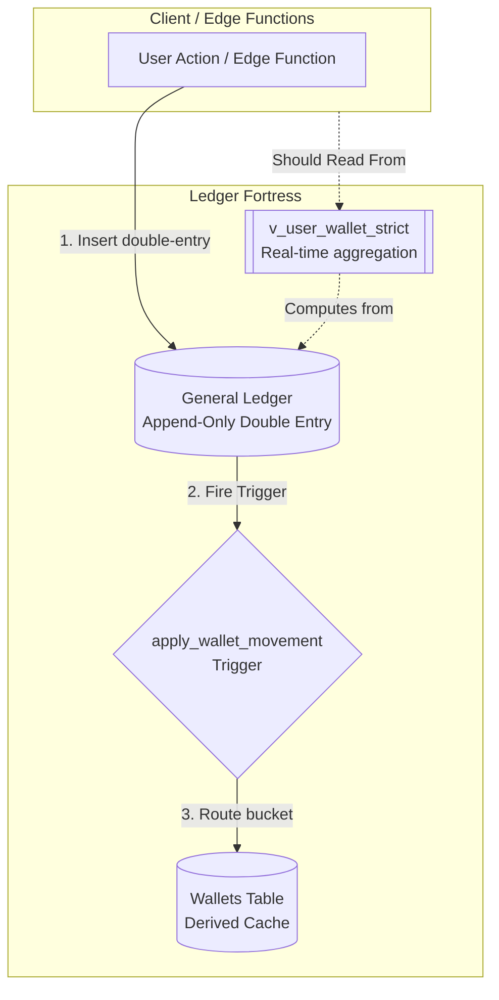
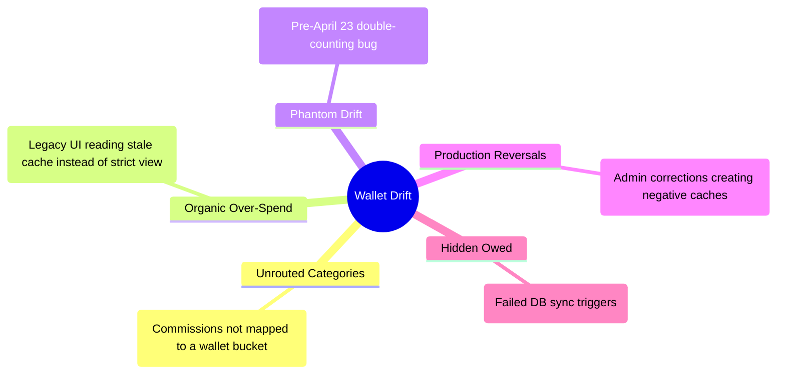
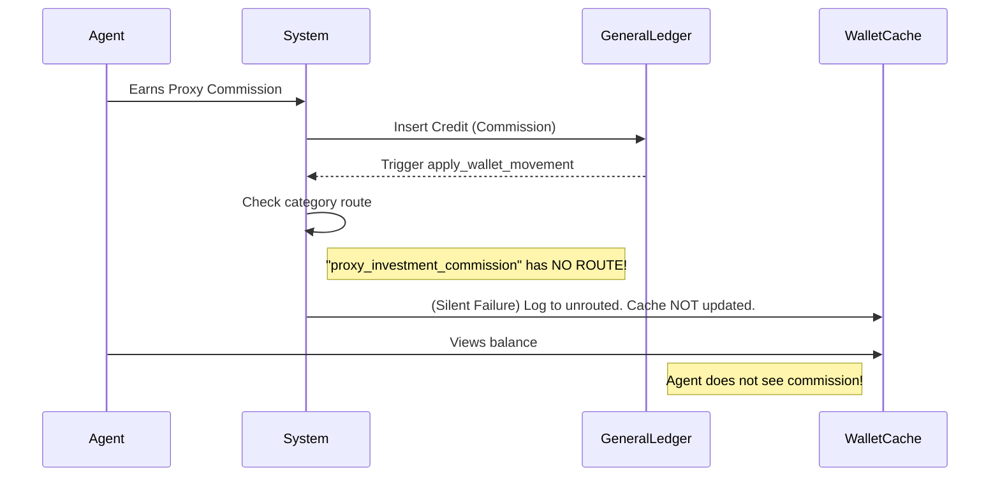

# Welile Financial Architecture & Ledger Fortress Guide

**Confidential - Internal Engineering Documentation**

This document serves as the definitive guide to Welile's core financial architecture. It explains the "Ledger Fortress" paradigm, the data flow, the root causes of the "Wallet Drift" bug, and how we must write code to prevent financial inconsistencies.

---

## 1. The Ledger Fortress Architecture

The system operates on a strict **Ledger Fortress** architecture. The core rule is simple: **The General Ledger is the absolute single source of truth.**

### The Dual-Surface Data Model

There are two read surfaces in the system:
1. **The Strict Ledger View (`v_user_wallet_strict`)**: Real-time aggregation of the double-entry `general_ledger` table.
2. **The Cache (`wallets`)**: A derived cache table holding raw integers (`balance`, `withdrawable_balance`, `float_balance`) for quick read access.

---

## 2. Wallet Drift: The Root Cause of the Failures

The reason for the continuous patching loops (especially around wallets and commissions) is **Wallet Drift**. Wallet drift occurs when the Cache (`wallets` table) stops matching the Truth (`general_ledger`).

There are two types of drift:
- **Phantom Drift:** The Cache shows more money than the Ledger. Users see money they don't have, and withdrawals are blocked by the strict view.
- **Hidden Owed:** The Ledger has the money, but the Cache didn't update. Users earn money (e.g., commissions), but their wallet doesn't reflect it.

### The 5 Sources of Drift

---

## 3. The Commission Bug (Unrouted Categories)

Why do commissions keep failing to appear? 
When a ledger transaction is created for a category like `proxy_investment_commission`, the `apply_wallet_movement` DB function does not know which bucket (e.g., `withdrawable_balance`) to put the money into. Instead of updating the wallet, it logs it to `wallet_unrouted_movements`.

---

## 4. Engineering Rules: How to Stop the Patching

To stop patching and stabilize the financial architecture, all engineers must adhere to the following rules:

### Rule 1: NEVER `UPDATE` the Wallets Table Directly
Writing manual SQL to patch negative balances or missing commissions breaks the double-entry accounting model. Database triggers (`enforce_wallet_ledger_only`) will fight you and cause the cache to instantly drift again.

### Rule 2: Fix issues via Ledger Reconciliations
If a user is missing money, **post a balanced `admin_correction` pair to the `general_ledger`**. Use the `reconcile_wallet_from_ledger` RPC. This automatically corrects the wallet cache in a safe, auditable manner.

### Rule 3: Always Read Strict Views in the Frontend
No UI component (`src/components/wallet`, `/agent`, etc.) should ever directly fetch `wallets.balance` or `wallets.withdrawable_balance`. 
**Mandatory:** Use `get_user_wallet_view()` or the `v_user_wallet_strict` view via hooks like `useAvailableBalance` or `useAgentBalances`.

### Rule 4: Route New Categories
If you introduce a new earning type (e.g., a new commission), you must update the `apply_wallet_movement` DB function to route that category to a specific wallet bucket.

---

> *"Build systems that can evolve without breaking. The Ledger is the truth. The Wallet is just a mirror."*
